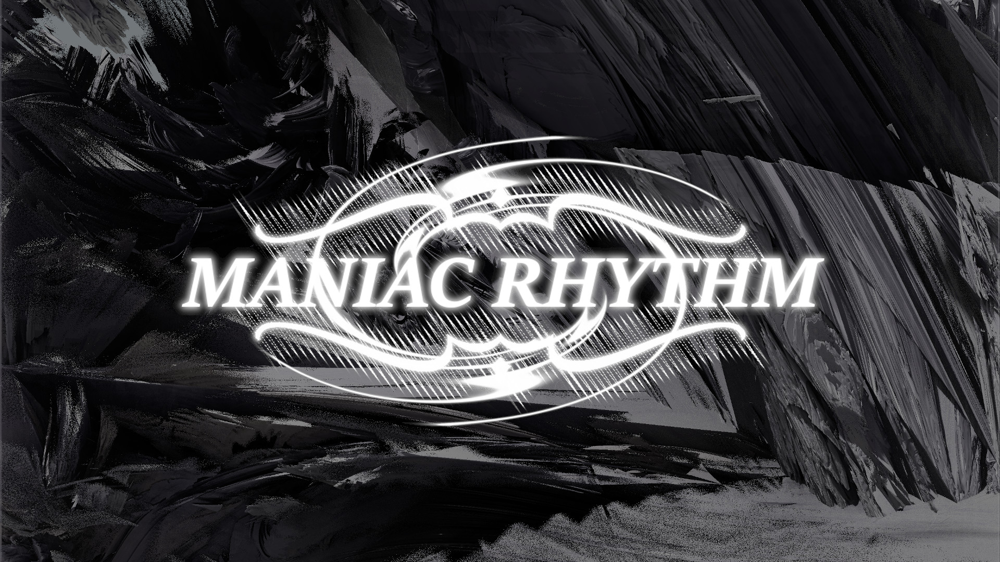

# ManiacRhythm

Current Version: alpha v0.1

## What is it?
Maniac Rhythm is a bemani-style rhythm game made in Unity utilizing techniques discussed by Yu Chao and Graham Tattersall on Gamasutra.

This project will utilize a four note button layout (equivalent to 4B style in DJMAX), with all music and visuals coming from projects by Vanja Venezia.

The visual style is heavily influenced by Sega Saturn era bullet hell games, particularly the aesthetics of Ikaruga and Radiant Silvergun (both by Treasure), hence the nod to Japanese bullet hell games via "Maniac".

There will be selectable songs and difficulty levels as well as unreleased music made specifically for this game (if time allows).

Some base code for the Conductor class I'm using as well as techniques used throughout are borrowed from Yu Chao and Graham Tattersall. I pulled these techniques specifically from from Yu Chao's [Music Syncing in Rhythm Games (Gamasutra)](https://www.gamasutra.com/blogs/YuChao/20170316/293814/Music_Syncing_in_Rhythm_Games.php) and Graham Tattersall's [Coding to the Beat - Under the Hood of a Rhythm Game in Unity (Gamasutra)](https://www.gamasutra.com/blogs/GrahamTattersall/20190515/342454/Coding_to_the_Beat__Under_the_Hood_of_a_Rhythm_Game_in_Unity.php).

A free-for-personal use graphical asset was used to create the title screen and song name accents, it can be found [here](http://clipartmag.com/download-clipart-image#accent-line-cliparts-33.jpg).

Background of title / splash screen was created in [Mandelbulber](https://www.mandelbulber.com/).

Audio reactive background graphics for songs will be constructed in and rendered from [Magic Music Visuals](https://magicmusicvisuals.com/).

## Gameplay Demo

## Goals
1. Four note lanes with fair judgement
2. Clean and appealing visuals
3. Audio reactive video backgrounds
4. Track selection
5. Difficulty selection

## Auxiliary Goals
1. 5B, 6B, 7B, 8B, or 10B mode
2. More music than the two songs planned
3. Ranking / leaderboards
5. 2 player mode
7. Visual charting engine

## Changelog

As of alpha v0.1.2
1. csvToMrc app for converting \*.csv files to  \*.txt files formatted in my proprietary MRC format. This enables charting in Excel / Google Sheets which is much simpler given it's column-based arithmetic features
2. Fixed bug that caused accuracy to go negative sometimes if no notes are hit at the beginning of a song.
3. Results screen now navigates back to song select with back key

As of alpha v0.1.1
1. Song select menu
2. New song: "Treasure" by Successor
3. Fixed bug that prevented engine from reconizing Full Combos

As of alpha v0.1:
1. Four note lanes
2. Two difficulty selections that correspond to normal or strict judgement
3. Audio reactive video background
4. Combo system with point multipliers
5. Max Combo / Full Combo tracking
6. Grade assigned based on accuracy
7. One song, half of actual song length